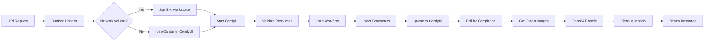

# RunPod Serverless ComfyUI with Qwen

**English** | **[Français](README.fr.md)**

Serverless worker for RunPod enabling ComfyUI workflow execution with multi-worker support and Qwen model integration.

[](https://github.com/unicorncomfyui/serverless_runpod/actions/workflows/docker-build.yml)

## Table of Contents

- [Overview](#overview)
- [Features](#features)
- [Architecture](#architecture)
- [Prerequisites](#prerequisites)
- [Quick Start](#quick-start)
- [Detailed Configuration](#detailed-configuration)
- [RunPod Network Volume](#runpod-network-volume)
- [RunPod Deployment](#runpod-deployment)
- [API Usage](#api-usage)
- [Available Workflows](#available-workflows)
- [Installed Custom Nodes](#installed-custom-nodes)
- [Local Development](#local-development)
- [Troubleshooting](#troubleshooting)
- [Performance and Optimization](#performance-and-optimization)
- [FAQ](#faq)

## Overview

This project adapts the [comfyui-qwen-template](https://github.com/Hearmeman24/comfyui-qwen-template) for serverless use on RunPod. It enables deploying ComfyUI with Qwen models in an auto-scalable environment with automatic resource management.

### Key differences from a classic Pod

| Aspect | Classic Pod | Serverless (this project) |
|--------|-------------|---------------------------|
| **Startup** | Always active | On-demand |
| **Cost** | Continuous billing | Pay-per-use |
| **Scalability** | Manual | Automatic (0-N workers) |
| **Network Volume** | Mounted on `/workspace` | Mounted on `/runpod-volume` |
| **API** | Direct ComfyUI access | RunPod handler with endpoints |

## Features

### Main Features

- **Auto-scaling**: Workers that start/stop automatically based on load
- **Multi-worker**: Parallel processing of multiple simultaneous requests
- **Network Volume**: Full support for RunPod network volumes with automatic symlink
- **21 Custom Nodes**: Complete set of pre-installed ComfyUI nodes
- **Resource management**: Automatic memory/disk verification before each job
- **Automatic cleanup**: Model unloading and cleanup after processing
- **Flexible workflows**: txt2img, img2img, and custom workflows

### Technical Stack

- **Base**: CUDA 12.8.1 + cuDNN + Ubuntu 24.04
- **Python**: 3.11 (via deadsnakes PPA)
- **PyTorch**: Nightly builds with CUDA 12.8 support
- **ComfyUI**: Latest version from GitHub
- **RunPod SDK**: For serverless integration

## Architecture

### Project Structure

```
serverless_runpod/
├── 📄 handler.py                  # Main RunPod serverless handler
├── 🚀 start.sh                    # Startup script with Network Volume management
├── 🐳 Dockerfile                  # Docker image CUDA 12.8.1 + Python 3.11
├── 🔧 docker-compose.yml          # Configuration for local testing
├── 📦 requirements.txt            # Python dependencies (RunPod SDK, etc.)
├── 🔐 .env.example                # Configuration template
├── 📋 docker-bake.hcl             # Docker buildx configuration
├── .github/workflows/
│   └── docker-build.yml           # Automatic CI/CD to Docker Hub
├── workflows/                     # ComfyUI JSON workflows
│   ├── txt2img.json               # Text → image generation
│   ├── img2img.json               # Image → image transformation
│   └── .gitkeep
├── schemas/                       # Input validation schemas
│   ├── input_schema.json          # JSON Schema for validation
│   └── .gitkeep
├── models/                        # Models (not versioned in git)
│   ├── checkpoints/               # Main models (.safetensors, .ckpt)
│   ├── upscale_models/            # Upscaling models (.pth)
│   ├── loras/                     # LoRA
│   ├── vae/                       # VAE
│   └── embeddings/                # Embeddings
├── input/                         # Input images for local testing
├── output/                        # Generated images (local testing)
└── tests/                         # Unit tests
```

### Processing Flow



## Prerequisites

### For RunPod deployment

- ✅ Active RunPod account
- ✅ RunPod API key ([get it here](https://www.runpod.io/console/user/settings))
- ✅ Hosted Docker image (Docker Hub, GHCR, or other registry)
- ✅ RunPod Network Volume (optional but recommended) with pre-installed ComfyUI

### For local development

- ✅ Docker Desktop with GPU support (NVIDIA)
- ✅ Docker Compose v2+
- ✅ NVIDIA GPU with installed drivers
- ✅ Minimum 8GB VRAM recommended
- ✅ Git and Git LFS

## Quick Start

### Method 1: Use pre-built image (Recommended)

```bash
# Image is automatically built by GitHub Actions
docker pull vlop12ui/runpod-comfyui-qwen:latest
```

### Method 2: Build from source

```bash
# 1. Clone the repo
git clone https://github.com/unicorncomfyui/serverless_runpod.git
cd serverless_runpod

# 2. Checkout to develop (active branch)
git checkout develop

# 3. Copy environment example
cp .env.example .env

# 4. Edit .env with your parameters
nano .env  # or your preferred editor

# 5. Build the image
docker build -t runpod-comfyui-qwen:latest .

# 6. Local test (optional)
docker-compose up
```

## Detailed Configuration

### Environment Variables

#### RunPod Configuration (Required for production)

| Variable | Description | Default value | Required |
|----------|-------------|---------------|----------|
| `RUNPOD_API_KEY` | RunPod API key for authentication | - | ✅ Production |
| `RUNPOD_ENDPOINT_ID` | Serverless endpoint ID | - | ❌ |

#### ComfyUI Configuration

| Variable | Description | Default value | Required |
|----------|-------------|---------------|----------|
| `COMFYUI_PORT` | ComfyUI listening port | `3000` | ❌ |
| `COMFYUI_HOST` | ComfyUI API host | `http://127.0.0.1:3000` | ❌ |

#### Resource Management

| Variable | Description | Default value | Required |
|----------|-------------|---------------|----------|
| `TIMEOUT_SECONDS` | Max timeout for a job (seconds) | `600` (10 min) | ❌ |
| `MIN_FREE_DISK_GB` | Minimum required disk space (GB) | `0.5` | ❌ |
| `MIN_FREE_MEMORY_GB` | Minimum available RAM (GB) | `1.0` | ❌ |

#### Logging and Debug

| Variable | Description | Possible values | Default |
|----------|-------------|-----------------|---------|
| `LOG_LEVEL` | Log verbosity level | `DEBUG`, `INFO`, `WARNING`, `ERROR` | `INFO` |

## RunPod Network Volume

### Why use a Network Volume?

1. **Persistence**: Models retained between restarts
2. **Performance**: No need to download models at each startup
3. **Cost savings**: Share models between multiple endpoints
4. **Flexibility**: Update models without rebuild

### Recommended Network Volume structure

```
/runpod-volume/  (becomes /workspace via symlink)
├── ComfyUI/                    # ComfyUI installation
│   ├── main.py
│   ├── models/
│   │   ├── checkpoints/        # Your .safetensors models
│   │   ├── upscale_models/     # 4xLSDIR.pth, Eyes.pt, etc.
│   │   ├── loras/
│   │   ├── vae/
│   │   └── embeddings/
│   ├── custom_nodes/           # Custom nodes (optional)
│   ├── output/                 # Generated images
│   └── input/                  # Source images
├── venv/                       # Python virtual environment (optional)
│   └── bin/activate
└── logs/                       # Persistent logs
```

## RunPod Deployment

### Step 1: Prepare Docker image

Use the pre-built image: `vlop12ui/runpod-comfyui-qwen:latest`

### Step 2: Create Serverless Endpoint

#### Via RunPod interface

1. **Access Serverless**
   - Go to [RunPod Console](https://www.runpod.io/console/serverless)
   - Click **+ New Endpoint**

2. **Basic configuration**
   - **Endpoint Name**: `comfyui-qwen-worker`
   - **Container Image**: `vlop12ui/runpod-comfyui-qwen:latest`
   - **Container Disk**: 10 GB minimum

3. **GPU Configuration**
   - **GPU Type**:
     - Recommended: RTX 5090 (~$0.90/hour) - Blackwell architecture (sm_120)
     - Alternative: A100 40GB (~$1.10/hour)
   - **Active Workers**: 0 (auto-scaling)
   - **Max Workers**: 3-5 depending on your budget
   - **GPUs per Worker**: 1

4. **Advanced Configuration**
   - **Idle Timeout**: 30 seconds
   - **Execution Timeout**: 600 seconds (10 min)
   - **Max Concurrent Requests per Worker**: 1

5. **Network Volume** (if available)
   - Select your volume `comfyui-qwen-models`

6. **Environment Variables**
   ```
   COMFYUI_PORT=3000
   TIMEOUT_SECONDS=600
   LOG_LEVEL=INFO
   ```

7. **Click "Deploy"**

## API Usage

### Available Endpoints

| Endpoint | Method | Description |
|----------|--------|-------------|
| `/run` or `/runsync` | POST | Synchronous execution (waits for response) |
| `/run` (async) | POST | Asynchronous execution (returns job_id) |
| `/status/{job_id}` | GET | Status of an async job |
| `/health` | GET | Endpoint health check |

### Custom workflow (ComfyUI API format)

To use a custom workflow in ComfyUI API format:

```json
{
  "input": {
    "workflow": {
      "6": {
        "inputs": {
          "text": ["152", 0],
          "clip": ["99", 0]
        },
        "class_type": "CLIPTextEncode",
        "_meta": {"title": "CLIP Text Encode (Positive Prompt)"}
      },
      "7": {
        "inputs": {
          "text": ["109", 0],
          "clip": ["99", 0]
        },
        "class_type": "CLIPTextEncode",
        "_meta": {"title": "CLIP Text Encode (Negative Prompt)"}
      },
      "8": {
        "inputs": {
          "samples": ["204", 0],
          "vae": ["39", 0]
        },
        "class_type": "VAEDecode",
        "_meta": {"title": "VAE Decode"}
      },
      "39": {
        "inputs": {"vae_name": "ae.safetensors"},
        "class_type": "VAELoader",
        "_meta": {"title": "Load VAE"}
      },
      "95": {
        "inputs": {
          "width": ["197", 0],
          "height": ["198", 0],
          "batch_size": 1
        },
        "class_type": "EmptyLatentImage",
        "_meta": {"title": "Empty Latent"}
      },
      "96": {
        "inputs": {
          "unet_name": "z_image_turbo_bf16.safetensors",
          "weight_dtype": "default"
        },
        "class_type": "UNETLoader",
        "_meta": {"title": "Load Diffusion Model"}
      },
      "99": {
        "inputs": {
          "clip_name": "qwen_3_4b.safetensors",
          "type": "qwen_image",
          "device": "default"
        },
        "class_type": "CLIPLoader",
        "_meta": {"title": "Load CLIP"}
      },
      "109": {
        "inputs": {
          "text": "low quality, blurry, distorted, bad anatomy"
        },
        "class_type": "Text Prompt (JPS)",
        "_meta": {"title": "Negative Prompt"}
      },
      "152": {
        "inputs": {
          "text": "a beautiful landscape, mountains at sunset, highly detailed, photorealistic"
        },
        "class_type": "Text Prompt (JPS)",
        "_meta": {"title": "Positive Prompt"}
      },
      "173": {
        "inputs": {"Number": "1"},
        "class_type": "Float",
        "_meta": {"title": "Resolution Multiplier"}
      },
      "179": {
        "inputs": {"model": ["96", 0]},
        "class_type": "ModelPassThrough",
        "_meta": {"title": "ModelPass"}
      },
      "195": {
        "inputs": {"value": 1080},
        "class_type": "PrimitiveInt",
        "_meta": {"title": "Image Width"}
      },
      "196": {
        "inputs": {"value": 1920},
        "class_type": "PrimitiveInt",
        "_meta": {"title": "Image Height"}
      },
      "197": {
        "inputs": {
          "value": "a*b",
          "a": ["195", 0],
          "b": ["173", 0]
        },
        "class_type": "SimpleMath+",
        "_meta": {"title": "🔧 Simple Math"}
      },
      "198": {
        "inputs": {
          "value": "a*b",
          "a": ["196", 0],
          "b": ["173", 0]
        },
        "class_type": "SimpleMath+",
        "_meta": {"title": "🔧 Simple Math"}
      },
      "204": {
        "inputs": {
          "seed": 123456789,
          "steps": 12,
          "cfg": 1,
          "sampler_name": "er_sde",
          "scheduler": "simple",
          "denoise": 1,
          "model": ["179", 0],
          "positive": ["6", 0],
          "negative": ["7", 0],
          "latent_image": ["95", 0]
        },
        "class_type": "KSampler",
        "_meta": {"title": "KSampler"}
      },
      "205": {
        "inputs": {
          "filename_prefix": "ComfyUI",
          "images": ["8", 0]
        },
        "class_type": "SaveImage",
        "_meta": {"title": "Save Image"}
      }
    }
  }
}
```

### Custom workflow (ComfyUI UI format)

You can also send the JSON exported from ComfyUI UI directly. The handler will automatically convert it to API format:

```json
{
  "input": {
    "workflow": {
      "id": "workflow-id",
      "nodes": [
        {
          "id": 1,
          "type": "CheckpointLoaderSimple",
          "widgets_values": ["model.safetensors"]
        }
      ],
      "links": [],
      "groups": []
    }
  }
}
```

**Important note:** The workflow must contain models that exist on your Network Volume. Expected files for the Z_Image_Turbo workflow are:
- `z_image_turbo_bf16.safetensors` (model)
- `ae.safetensors` (VAE)
- `qwen_3_4b.safetensors` (CLIP)

**About LoRA:** LoRA (Low-Rank Adaptation) are lightweight fine-tuning files that allow adjusting a base model for specific styles or concepts without having to train a complete model. They are optional and can be added to the workflow if needed in `/runpod-volume/ComfyUI/models/loras/`.

### Response Format

#### Success

```json
{
  "delayTime": 1234,
  "executionTime": 5678,
  "id": "job-abc-123",
  "output": {
    "images": [
      "iVBORw0KGgoAAAANSUhEUgAA..."
    ],
    "prompt_id": "uuid-123-456",
    "workflow_type": "custom"
  },
  "status": "COMPLETED"
}
```

#### Error

```json
{
  "id": "job-abc-123",
  "status": "FAILED",
  "error": "Insufficient memory. Available: 0.8GB"
}
```

## Installed Custom Nodes

The project includes 21 pre-installed ComfyUI custom nodes:

| Node | Description | Repository |
|------|-------------|------------|
| **UltimateSDUpscale** | Advanced upscaling for SD | [ssitu/ComfyUI_UltimateSDUpscale](https://github.com/ssitu/ComfyUI_UltimateSDUpscale) |
| **KJNodes** | Utility nodes collection | [kijai/ComfyUI-KJNodes](https://github.com/kijai/ComfyUI-KJNodes) |
| **rgthree-comfy** | Workflow improvement nodes | [rgthree/rgthree-comfy](https://github.com/rgthree/rgthree-comfy) |
| **JPS-Nodes** | Various custom nodes | [JPS-GER/ComfyUI_JPS-Nodes](https://github.com/JPS-GER/ComfyUI_JPS-Nodes) |
| **Comfyroll** | Style and effects nodes | [Suzie1/ComfyUI_Comfyroll_CustomNodes](https://github.com/Suzie1/ComfyUI_Comfyroll_CustomNodes) |
| **comfy-plasma** | Plasma and gradient effects | [Jordach/comfy-plasma](https://github.com/Jordach/comfy-plasma) |
| **Impact Pack** | Complete post-processing pack | [ltdrdata/ComfyUI-Impact-Pack](https://github.com/ltdrdata/ComfyUI-Impact-Pack) |
| **RES4LYF** | Resolution and quality nodes | [ClownsharkBatwing/RES4LYF](https://github.com/ClownsharkBatwing/RES4LYF) |
| **Easy-Use** | Workflow simplification | [yolain/ComfyUI-Easy-Use](https://github.com/yolain/ComfyUI-Easy-Use) |
| **WAS Node Suite** | Complete node suite | [WASasquatch/was-node-suite-comfyui](https://github.com/WASasquatch/was-node-suite-comfyui) |
| **Logic** | Logical and conditional nodes | [theUpsider/ComfyUI-Logic](https://github.com/theUpsider/ComfyUI-Logic) |
| **Essentials** | Missing essential nodes | [cubiq/ComfyUI_essentials](https://github.com/cubiq/ComfyUI_essentials) |
| **Image Picker** | Image selection | [chrisgoringe/cg-image-picker](https://github.com/chrisgoringe/cg-image-picker) |
| **LayerStyle** | Layer-based style effects | [chflame163/ComfyUI_LayerStyle](https://github.com/chflame163/ComfyUI_LayerStyle) |

## Performance and Optimization

### Average Processing Times

| Resolution | Steps | GPU | Estimated Time |
|-----------|-------|-----|----------------|
| 512x512 | 12 | RTX 5090 | ~3-5s |
| 1080x1920 | 12 | RTX 5090 | ~10-12s |
| 1024x1024 | 20 | RTX 5090 | ~15-20s |
| 512x512 | 50 | RTX 5090 | ~10-15s |
| 1024x1024 | 50 | A100 | ~25-35s |

### Recommended Optimizations

1. **Use Network Volume**: Avoids downloading models
2. **Batch processing**: Group multiple images in one request
3. **Fast sampler**: `euler` or `euler_a` instead of `dpm++`
4. **Optimal steps**: 20-28 steps are usually sufficient
5. **Short idle timeout**: 30s to reduce costs

### Cost Estimation

**Example with RTX 5090** (~$0.90/h = $0.00025/s):
- 1 image 512x512 (5s): ~$0.00125
- 1 image 1024x1024 (15s): ~$0.00375
- 1 image 1080x1920 (12s): ~$0.003
- 100 images 1080x1920/day: ~$0.30/day = ~$9/month

## FAQ

**Q: Can I use my own models?**
A: Yes, place them in the Network Volume under `/runpod-volume/ComfyUI/models/checkpoints/`

**Q: How many workers should I configure?**
A: Start with Max 3, adjust based on your load. Min=0 for complete auto-scaling.

**Q: Is the Docker image public?**
A: Yes, `vlop12ui/runpod-comfyui-qwen:latest` is public on Docker Hub.

**Q: Can I add custom nodes?**
A: Yes, clone them in `/runpod-volume/ComfyUI/custom_nodes/` or modify the Dockerfile.

**Q: What's the difference with a normal pod?**
A: Serverless = auto-scaling + pay-per-use. Pod = always active + continuous billing.

**Q: Can I use LoRA?**
A: Yes, place .safetensors files in `/runpod-volume/ComfyUI/models/loras/`

---

## Contributing

Contributions are welcome!

1. Fork the project
2. Create a feature branch (`git checkout -b feature/amazing-feature`)
3. Commit your changes (`git commit -m 'Add amazing feature'`)
4. Push to the branch (`git push origin feature/amazing-feature`)
5. Open a Pull Request

## License

This project is licensed under **AGPL-3.0** (inherited from the ComfyUI Qwen template).

This means if you use this code to provide a network service, you must make your source code available.

## Roadmap

- [ ] ControlNet support
- [ ] Dynamic LoRA support
- [ ] Model caching between workers
- [ ] Prometheus metrics
- [ ] Webhooks for notifications
- [ ] Optimized batch processing support
- [ ] Web management interface
- [ ] Simultaneous multi-model support

## Security

Security is a top priority. Please review our [Security Policy](SECURITY.md) for:

- Reporting vulnerabilities
- Security best practices
- Dependency CVE status
- Automated security scanning

### Quick Security Checklist

Before deploying to production:

- [ ] All secrets in environment variables (never in code)
- [ ] Dependencies updated to latest patch versions
- [ ] Docker image scanned for vulnerabilities
- [ ] Resource limits configured (timeout, memory)
- [ ] Only trusted models and workflows
- [ ] Network Volume permissions verified

See [SECURITY.md](SECURITY.md) for detailed security guidelines.

## Support and Documentation

### Useful Links

- **Security Policy**: [SECURITY.md](SECURITY.md)
- **RunPod Documentation**: https://docs.runpod.io/
- **ComfyUI Documentation**: https://github.com/comfyanonymous/ComfyUI
- **GitHub Issues**: https://github.com/unicorncomfyui/serverless_runpod/issues
- **Original Template**: https://github.com/Hearmeman24/comfyui-qwen-template

---

**Developed for RunPod Serverless**
- Base: CUDA 12.8.1 + cuDNN + Ubuntu 24.04
- Python 3.11
- ComfyUI + 21 Custom Nodes
- Multi-worker auto-scaling

*Last update: December 2025*
