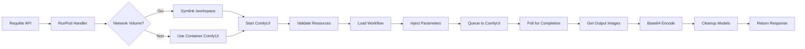

# RunPod Serverless ComfyUI avec Qwen

Worker serverless pour RunPod permettant l'exécution de workflows ComfyUI avec support multi-worker et intégration de modèles Qwen.

[](https://github.com/unicorncomfyui/serverless_runpod/actions/workflows/docker-build.yml)

## Table des Matières

- [Vue d'ensemble](#vue-densemble)
- [Caractéristiques](#caractéristiques)
- [Architecture](#architecture)
- [Prérequis](#prérequis)
- [Installation Rapide](#installation-rapide)
- [Configuration Détaillée](#configuration-détaillée)
- [Network Volume RunPod](#network-volume-runpod)
- [Déploiement sur RunPod](#déploiement-sur-runpod)
- [Utilisation de l'API](#utilisation-de-lapi)
- [Workflows Disponibles](#workflows-disponibles)
- [Custom Nodes Installés](#custom-nodes-installés)
- [Développement Local](#développement-local)
- [Troubleshooting](#troubleshooting)
- [Performances et Optimisation](#performances-et-optimisation)
- [FAQ](#faq)

## Vue d'ensemble

Ce projet adapte le template [comfyui-qwen-template](https://github.com/Hearmeman24/comfyui-qwen-template) pour une utilisation serverless sur RunPod. Il permet de déployer ComfyUI avec des modèles Qwen dans un environnement auto-scalable avec gestion automatique des ressources.

### Différences clés avec un Pod classique

| Aspect | Pod Classique | Serverless (ce projet) |
|--------|---------------|------------------------|
| **Démarrage** | Toujours actif | À la demande |
| **Coût** | Payé en continu | Payé à l'utilisation |
| **Scalabilité** | Manuelle | Automatique (0-N workers) |
| **Network Volume** | Monté sur `/workspace` | Monté sur `/runpod-volume` |
| **API** | Accès direct ComfyUI | Handler RunPod avec endpoints |

## Caractéristiques

### Fonctionnalités principales

- **Auto-scaling** : Workers qui se lancent/arrêtent automatiquement selon la charge
- **Multi-worker** : Traitement parallèle de plusieurs requêtes simultanées
- **Network Volume** : Support complet des volumes réseau RunPod avec symlink automatique
- **21 Custom Nodes** : Ensemble complet de nodes ComfyUI pré-installés
- **Gestion des ressources** : Vérification automatique mémoire/disque avant chaque job
- **Nettoyage automatique** : Libération des modèles et nettoyage après traitement
- **Workflows flexibles** : txt2img, img2img, et workflows personnalisés

### Stack technique

- **Base** : CUDA 12.8.1 + cuDNN + Ubuntu 24.04
- **Python** : 3.11 (via deadsnakes PPA)
- **PyTorch** : Version stable compatible CUDA 12.x
- **ComfyUI** : Dernière version depuis GitHub
- **RunPod SDK** : Pour l'intégration serverless

## Architecture

### Structure du projet

```
serverless_runpod/
├── 📄 handler.py                  # Handler RunPod serverless principal
├── 🚀 start.sh                    # Script de démarrage avec gestion Network Volume
├── 🐳 Dockerfile                  # Image Docker CUDA 12.8.1 + Python 3.11
├── 🔧 docker-compose.yml          # Configuration pour tests locaux
├── 📦 requirements.txt            # Dépendances Python (RunPod SDK, etc.)
├── 🔐 .env.example                # Template de configuration
├── 📋 docker-bake.hcl             # Configuration Docker buildx
├── .github/workflows/
│   └── docker-build.yml           # CI/CD automatique vers Docker Hub
├── workflows/                     # Workflows ComfyUI JSON
│   ├── txt2img.json               # Génération texte → image
│   ├── img2img.json               # Transformation image → image
│   └── .gitkeep
├── schemas/                       # Schémas de validation d'input
│   ├── input_schema.json          # JSON Schema pour validation
│   └── .gitkeep
├── models/                        # Modèles (non versionnés dans git)
│   ├── checkpoints/               # Modèles principaux (.safetensors, .ckpt)
│   ├── upscale_models/            # Modèles d'upscaling (.pth)
│   ├── loras/                     # LoRA
│   ├── vae/                       # VAE
│   └── embeddings/                # Embeddings
├── input/                         # Images d'entrée pour tests locaux
├── output/                        # Images générées (tests locaux)
└── tests/                         # Tests unitaires
```

### Flux de traitement



## Prérequis

### Pour le déploiement RunPod

- ✅ Compte RunPod actif
- ✅ Clé API RunPod ([obtenir ici](https://www.runpod.io/console/user/settings))
- ✅ Image Docker hébergée (Docker Hub, GHCR, ou autre registry)
- ✅ Network Volume RunPod (optionnel mais recommandé) avec ComfyUI pré-installé

### Pour le développement local

- ✅ Docker Desktop avec support GPU (NVIDIA)
- ✅ Docker Compose v2+
- ✅ NVIDIA GPU avec drivers installés
- ✅ Minimum 8GB VRAM recommandé
- ✅ Git et Git LFS

## Installation Rapide

### Méthode 1 : Utiliser l'image pré-construite (Recommandé)

```bash
# L'image est automatiquement buildée par GitHub Actions
docker pull vlop12ui/runpod-comfyui-qwen:latest
```

### Méthode 2 : Build depuis les sources

```bash
# 1. Cloner le repo
git clone https://github.com/unicorncomfyui/serverless_runpod.git
cd serverless_runpod

# 2. Checkout sur develop (branche active)
git checkout develop

# 3. Copier l'exemple d'environnement
cp .env.example .env

# 4. Éditer .env avec vos paramètres
nano .env  # ou votre éditeur préféré

# 5. Build l'image
docker build -t runpod-comfyui-qwen:latest .

# 6. Test local (optionnel)
docker-compose up
```

## Configuration Détaillée

### Variables d'environnement

#### Configuration RunPod (Obligatoire pour production)

| Variable | Description | Valeur par défaut | Obligatoire |
|----------|-------------|-------------------|-------------|
| `RUNPOD_API_KEY` | Clé API RunPod pour authentification | - | ✅ Production |
| `RUNPOD_ENDPOINT_ID` | ID de l'endpoint serverless | - | ❌ |

#### Configuration ComfyUI

| Variable | Description | Valeur par défaut | Obligatoire |
|----------|-------------|-------------------|-------------|
| `COMFYUI_PORT` | Port d'écoute de ComfyUI | `3000` | ❌ |
| `COMFYUI_HOST` | Host de l'API ComfyUI | `http://127.0.0.1:3000` | ❌ |

#### Gestion des ressources

| Variable | Description | Valeur par défaut | Obligatoire |
|----------|-------------|-------------------|-------------|
| `TIMEOUT_SECONDS` | Timeout max pour un job (secondes) | `600` (10 min) | ❌ |
| `MIN_FREE_DISK_GB` | Espace disque minimum requis (GB) | `0.5` | ❌ |
| `MIN_FREE_MEMORY_GB` | RAM minimum disponible (GB) | `1.0` | ❌ |

#### Modèles et chemins

| Variable | Description | Valeur par défaut | Obligatoire |
|----------|-------------|-------------------|-------------|
| `DEFAULT_MODEL` | Modèle checkpoint par défaut | `qwen_model.safetensors` | ❌ |
| `UPSCALE_MODEL` | Modèle d'upscaling | `4xLSDIR.pth` | ❌ |
| `EYES_MODEL` | Modèle de détection des yeux | `Eyes.pt` | ❌ |

#### Logging et Debug

| Variable | Description | Valeurs possibles | Défaut |
|----------|-------------|-------------------|--------|
| `LOG_LEVEL` | Niveau de verbosité des logs | `DEBUG`, `INFO`, `WARNING`, `ERROR` | `INFO` |
| `SNAP_LOG_API_URL` | URL API pour logs externes (optionnel) | URL valide | - |
| `SNAP_LOG_API_KEY` | Clé API pour logs externes | - | - |

### Exemple de fichier .env complet

```env
# RunPod Configuration
RUNPOD_API_KEY=YOUR_RUNPOD_API_KEY_HERE
RUNPOD_ENDPOINT_ID=your-endpoint-id

# ComfyUI Configuration
COMFYUI_PORT=3000
COMFYUI_HOST=http://127.0.0.1:3000

# Model Configuration
DEFAULT_MODEL=qwen_model.safetensors
UPSCALE_MODEL=4xLSDIR.pth
EYES_MODEL=Eyes.pt

# Resource Limits
TIMEOUT_SECONDS=600
MIN_FREE_DISK_GB=0.5
MIN_FREE_MEMORY_GB=1.0

# Logging
LOG_LEVEL=INFO

# Optional: External Logging
# SNAP_LOG_API_URL=https://your-logging-service.com/api
# SNAP_LOG_API_KEY=your_logging_api_key
```

## Network Volume RunPod

### Pourquoi utiliser un Network Volume ?

1. **Persistance** : Modèles conservés entre les redémarrages
2. **Performance** : Pas besoin de télécharger les modèles à chaque démarrage
3. **Économies** : Partagez les modèles entre plusieurs endpoints
4. **Flexibilité** : Mettez à jour les modèles sans rebuild

### Structure recommandée du Network Volume

```
/runpod-volume/  (devient /workspace via symlink)
├── ComfyUI/                    # Installation ComfyUI
│   ├── main.py
│   ├── models/
│   │   ├── checkpoints/        # Vos modèles .safetensors
│   │   ├── upscale_models/     # 4xLSDIR.pth, Eyes.pt, etc.
│   │   ├── loras/
│   │   ├── vae/
│   │   └── embeddings/
│   ├── custom_nodes/           # Nodes personnalisés (optionnel)
│   ├── output/                 # Images générées
│   └── input/                  # Images source
├── venv/                       # Environnement virtuel Python (optionnel)
│   └── bin/activate
└── logs/                       # Logs persistants
```

### Configuration avec Network Volume

#### 1. Créer le Network Volume sur RunPod

1. Allez dans **Storage** → **Network Volumes**
2. Cliquez sur **+ New Network Volume**
3. Configurez :
   - **Name** : `comfyui-qwen-models`
   - **Size** : 50GB minimum (selon vos modèles)
   - **Region** : Même région que vos workers

#### 2. Installer ComfyUI sur le Volume

**Option A : Via un Pod temporaire**

```bash
# Lancez un pod avec le volume monté
# Puis dans le pod :
cd /workspace
git clone https://github.com/comfyanonymous/ComfyUI.git
cd ComfyUI
pip install -r requirements.txt

# Téléchargez vos modèles
cd models/checkpoints
wget https://your-model-url/qwen_model.safetensors

cd ../upscale_models
wget https://your-model-url/4xLSDIR.pth
```

**Option B : Upload depuis votre machine**

Utilisez `runpod` CLI ou l'interface web pour uploader directement.

#### 3. Monter le Volume dans l'Endpoint

Lors de la création de l'endpoint serverless :
- **Network Volume** : Sélectionnez votre volume
- Le volume sera automatiquement monté sur `/runpod-volume`
- Le [start.sh](start.sh:7-11) créera automatiquement le symlink vers `/workspace`

## Déploiement sur RunPod

### Étape 1 : Préparer l'image Docker

#### Option A : Utiliser GitHub Actions (Automatique)

L'image est buildée automatiquement à chaque push sur `develop` :

```bash
# Vérifiez que le build passe
https://github.com/unicorncomfyui/serverless_runpod/actions

# L'image sera disponible sur :
vlop12ui/runpod-comfyui-qwen:latest
```

#### Option B : Build et Push manuel

```bash
# 1. Login Docker Hub
docker login

# 2. Build
docker build -t your-username/runpod-comfyui-qwen:latest .

# 3. Push
docker push your-username/runpod-comfyui-qwen:latest
```

### Étape 2 : Créer l'Endpoint Serverless

#### Via l'interface RunPod

1. **Accédez à Serverless**
   - Allez sur [RunPod Console](https://www.runpod.io/console/serverless)
   - Cliquez sur **+ New Endpoint**

2. **Configuration de base**
   - **Endpoint Name** : `comfyui-qwen-worker`
   - **Container Image** : `vlop12ui/runpod-comfyui-qwen:latest`
   - **Container Disk** : 10 GB minimum

3. **Configuration GPU**
   - **GPU Type** :
     - Budget : RTX 4090 (~$0.40/heure)
     - Performance : A100 40GB (~$1.10/heure)
   - **Active Workers** : 0 (auto-scaling)
   - **Max Workers** : 3-5 selon votre budget
   - **GPUs per Worker** : 1

4. **Configuration Advanced**
   - **Idle Timeout** : 30 secondes
   - **Execution Timeout** : 600 secondes (10 min)
   - **Max Concurrent Requests per Worker** : 1

5. **Network Volume** (si disponible)
   - Sélectionnez votre volume `comfyui-qwen-models`

6. **Environment Variables**
   ```
   COMFYUI_PORT=3000
   TIMEOUT_SECONDS=600
   LOG_LEVEL=INFO
   ```

7. **Cliquez sur "Deploy"**

### Étape 3 : Tester l'Endpoint

Une fois déployé, vous recevrez un **Endpoint ID**. Testez-le :

```python
import runpod
import base64
from PIL import Image
from io import BytesIO

# Configuration
runpod.api_key = "YOUR_RUNPOD_API_KEY"
endpoint = runpod.Endpoint("YOUR_ENDPOINT_ID")

# Requête simple
request = {
    "input": {
        "workflow_type": "txt2img",
        "prompt": "a beautiful sunset over mountains, detailed, high quality",
        "negative_prompt": "blurry, low quality, distorted",
        "steps": 20,
        "cfg_scale": 7.0,
        "width": 512,
        "height": 512,
        "seed": 42
    }
}

# Lancer le job
print("Envoi de la requête...")
run_request = endpoint.run(request)

# Attendre et récupérer le résultat
print("Traitement en cours...")
result = run_request.output(timeout=600)

# Décoder et sauvegarder l'image
if "images" in result and len(result["images"]) > 0:
    image_data = base64.b64decode(result["images"][0])
    image = Image.open(BytesIO(image_data))
    image.save("output.png")
    print("✅ Image sauvegardée : output.png")
else:
    print("❌ Erreur:", result.get("error", "Unknown error"))
```

## Utilisation de l'API

### Endpoints disponibles

RunPod Serverless expose automatiquement ces endpoints :

| Endpoint | Méthode | Description |
|----------|---------|-------------|
| `/run` ou `/runsync` | POST | Exécution synchrone (attend la réponse) |
| `/run` (async) | POST | Exécution asynchrone (retourne job_id) |
| `/status/{job_id}` | GET | Statut d'un job asynchrone |
| `/health` | GET | Health check de l'endpoint |

### Format de requête détaillé

#### Workflow txt2img

```json
{
  "input": {
    "workflow_type": "txt2img",
    "prompt": "masterpiece, best quality, 1girl, detailed face",
    "negative_prompt": "worst quality, low quality, bad anatomy",
    "seed": 12345,
    "steps": 28,
    "cfg_scale": 7.5,
    "width": 768,
    "height": 768,
    "sampler_name": "euler_a",
    "scheduler": "karras",
    "model": "qwen_model.safetensors"
  }
}
```

#### Workflow img2img

```json
{
  "input": {
    "workflow_type": "img2img",
    "prompt": "enhance this image, more details",
    "negative_prompt": "blurry, low quality",
    "input_image": "base64_encoded_string_here...",
    "denoise": 0.7,
    "steps": 25,
    "cfg_scale": 7.0,
    "seed": 54321
  }
}
```

#### Workflow custom (format API ComfyUI)

Pour utiliser un workflow custom au format API ComfyUI:

```json
{
  "input": {
    "workflow": {
      "3": {
        "inputs": {
          "seed": 42,
          "steps": 20,
          ...
        },
        "class_type": "KSampler"
      },
      ...
    }
  }
}
```

#### Workflow custom (format UI ComfyUI)

Vous pouvez également envoyer directement le JSON exporté de l'UI ComfyUI. Le handler convertira automatiquement au format API:

```json
{
  "input": {
    "workflow": {
      "id": "workflow-id",
      "nodes": [
        {
          "id": 1,
          "type": "CheckpointLoaderSimple",
          "widgets_values": ["model.safetensors"]
        },
        ...
      ],
      "links": [...],
      "groups": [...]
    }
  }
}
```

**Exemple complet prêt à l'emploi (Z_Image_Turbo):**

Copiez-collez directement cet exemple dans l'UI RunPod ou via l'API:

<details>
<summary>Cliquez pour voir l'exemple complet JSON (workflow Qwen Z_Image_Turbo)</summary>

```json
{
  "input": {
    "workflow": VOTRE_WORKFLOW_ICI
  }
}
```

Remplacez `VOTRE_WORKFLOW_ICI` par le contenu du fichier `Z_Image_Turbo.json` fourni.

Pour tester rapidement, utilisez le fichier exemple dans `/workflows/zimage_turbo.json` sur votre Network Volume.

</details>

**Note importante:** Le workflow doit contenir les modèles/LoRAs qui existent sur votre Network Volume. Les fichiers attendus sont:
- `z_image_turbo_bf16.safetensors` (model)
- `ae.safetensors` (VAE)
- `qwen_3_4b.safetensors` (CLIP)
- Les LoRAs: `HMFemme_V1.safetensors`, `HearmemanAI_V4_Rank128_BreastsLoRA_Epoch80.safetensors`, etc.

### Format de réponse

#### Succès

```json
{
  "delayTime": 1234,
  "executionTime": 5678,
  "id": "job-abc-123",
  "output": {
    "images": [
      "iVBORw0KGgoAAAANSUhEUgAA...",  // Base64 encoded
      "iVBORw0KGgoAAAANSUhEUgAA..."
    ],
    "prompt_id": "uuid-123-456",
    "workflow_type": "txt2img"
  },
  "status": "COMPLETED"
}
```

#### Erreur

```json
{
  "id": "job-abc-123",
  "status": "FAILED",
  "error": "Insufficient memory. Available: 0.8GB"
}
```

## Workflows Disponibles

### txt2img - Génération texte vers image

Génère une image depuis une description textuelle.

**Paramètres** :
- `prompt` (string, requis) : Description de l'image désirée
- `negative_prompt` (string, optionnel) : Éléments à éviter
- `width` (int, optionnel) : Largeur (512/768/1024), défaut 512
- `height` (int, optionnel) : Hauteur (512/768/1024), défaut 512
- `steps` (int, optionnel) : Nombre d'étapes (1-150), défaut 20
- `cfg_scale` (float, optionnel) : Guidance (1.0-30.0), défaut 7.0
- `seed` (int, optionnel) : Seed aléatoire (0-4294967295), défaut random
- `sampler_name` (string, optionnel) : euler, euler_a, dpm_2, etc.
- `scheduler` (string, optionnel) : normal, karras, exponential
- `model` (string, optionnel) : Nom du checkpoint, défaut qwen_model.safetensors

### img2img - Transformation d'image

Transforme une image existante selon un prompt.

**Paramètres** :
- Tous les paramètres de txt2img, plus :
- `input_image` (string, requis) : Image encodée en base64
- `denoise` (float, optionnel) : Force de dénoising (0.0-1.0), défaut 0.75

### custom - Workflow personnalisé

Exécute un workflow ComfyUI personnalisé complet.

**Paramètres** :
- `custom_workflow` (object, requis) : Workflow JSON ComfyUI complet

## Custom Nodes Installés

Le projet inclut 21 custom nodes ComfyUI pré-installés :

| Node | Description | Repository |
|------|-------------|------------|
| **UltimateSDUpscale** | Upscaling avancé pour SD | [ssitu/ComfyUI_UltimateSDUpscale](https://github.com/ssitu/ComfyUI_UltimateSDUpscale) |
| **KJNodes** | Collection de nodes utilitaires | [kijai/ComfyUI-KJNodes](https://github.com/kijai/ComfyUI-KJNodes) |
| **rgthree-comfy** | Nodes pour améliorer le workflow | [rgthree/rgthree-comfy](https://github.com/rgthree/rgthree-comfy) |
| **JPS-Nodes** | Nodes personnalisés variés | [JPS-GER/ComfyUI_JPS-Nodes](https://github.com/JPS-GER/ComfyUI_JPS-Nodes) |
| **Comfyroll** | Nodes de style et effets | [Suzie1/ComfyUI_Comfyroll_CustomNodes](https://github.com/Suzie1/ComfyUI_Comfyroll_CustomNodes) |
| **comfy-plasma** | Effets plasma et gradients | [Jordach/comfy-plasma](https://github.com/Jordach/comfy-plasma) |
| **Impact Pack** | Pack complet pour post-traitement | [ltdrdata/ComfyUI-Impact-Pack](https://github.com/ltdrdata/ComfyUI-Impact-Pack) |
| **RES4LYF** | Nodes de résolution et qualité | [ClownsharkBatwing/RES4LYF](https://github.com/ClownsharkBatwing/RES4LYF) |
| **Easy-Use** | Simplification de workflows | [yolain/ComfyUI-Easy-Use](https://github.com/yolain/ComfyUI-Easy-Use) |
| **WAS Node Suite** | Suite complète de nodes | [WASasquatch/was-node-suite-comfyui](https://github.com/WASasquatch/was-node-suite-comfyui) |
| **Logic** | Nodes logiques et conditionnels | [theUpsider/ComfyUI-Logic](https://github.com/theUpsider/ComfyUI-Logic) |
| **Essentials** | Nodes essentiels manquants | [cubiq/ComfyUI_essentials](https://github.com/cubiq/ComfyUI_essentials) |
| **Image Picker** | Sélection d'images | [chrisgoringe/cg-image-picker](https://github.com/chrisgoringe/cg-image-picker) |
| **LayerStyle** | Effets de style par couches | [chflame163/ComfyUI_LayerStyle](https://github.com/chflame163/ComfyUI_LayerStyle) |
| **Impact Subpack** | Extension d'Impact Pack | [ltdrdata/ComfyUI-Impact-Subpack](https://github.com/ltdrdata/ComfyUI-Impact-Subpack) |
| **Detail Daemon** | Amélioration des détails | [Jonseed/ComfyUI-Detail-Daemon](https://github.com/Jonseed/ComfyUI-Detail-Daemon) |
| **Mixlab Nodes** | Collection mixte de nodes | [shadowcz007/comfyui-mixlab-nodes](https://github.com/shadowcz007/comfyui-mixlab-nodes) |
| **LayerStyle Advance** | LayerStyle avancé | [chflame163/ComfyUI_LayerStyle_Advance](https://github.com/chflame163/ComfyUI_LayerStyle_Advance) |
| **Mikey Nodes** | Nodes personnalisés Mikey | [bash-j/mikey_nodes](https://github.com/bash-j/mikey_nodes) |
| **Use Everywhere** | Connexions globales | [chrisgoringe/cg-use-everywhere](https://github.com/chrisgoringe/cg-use-everywhere) |
| **ComfyLiterals** | Support de littéraux | [M1kep/ComfyLiterals](https://github.com/M1kep/ComfyLiterals) |

## Développement Local

### Prérequis

```bash
pip install -r requirements.txt
```

### Test du handler seul

```bash
# Simuler une requête
python handler.py
```

### Test avec Docker Compose

```bash
# Lancer l'environnement complet
docker-compose up --build

# ComfyUI accessible sur http://localhost:3000
```

### Debug

Activez les logs détaillés :

```bash
export LOG_LEVEL=DEBUG
python handler.py
```

## Troubleshooting

### Problèmes courants

#### 1. Erreur "CUDA out of memory"

**Symptômes** : Le job échoue avec une erreur OOM

**Solutions** :
```bash
# Réduire la résolution
"width": 512, "height": 512  # Au lieu de 1024x1024

# Réduire batch_size dans le workflow
"batch_size": 1

# Utiliser une GPU avec plus de VRAM
# RTX 4090 (24GB) au lieu de RTX 3090 (24GB)
```

#### 2. ComfyUI ne démarre pas

**Symptômes** : Timeout lors du démarrage

**Solutions** :
```bash
# Vérifier les logs
docker-compose logs comfyui-worker

# Vérifier que ComfyUI existe
ls -la /workspace/ComfyUI  # ou /app/comfyui

# Vérifier les modèles
ls -la /workspace/ComfyUI/models/checkpoints/
```

#### 3. Network Volume non détecté

**Symptômes** : Warning "No network volume found"

**Solutions** :
```bash
# Vérifier que le volume est monté
ls -la /runpod-volume

# Vérifier les permissions
chmod -R 755 /runpod-volume

# Vérifier la configuration RunPod
# Le volume doit être attaché à l'endpoint
```

#### 4. Timeout sur les jobs

**Symptômes** : Job timeout après 600s

**Solutions** :
```bash
# Augmenter le timeout
ENV TIMEOUT_SECONDS=1200  # 20 minutes

# Optimiser le workflow
# - Réduire steps
# - Utiliser samplers plus rapides (euler au lieu de dpm++)
```

#### 5. Erreur d'authentification Docker Hub

**Symptômes** : Build GitHub Actions échoue avec "unauthorized"

**Solutions** :
```bash
# Vérifier les secrets GitHub
# Settings → Secrets → Actions
# DOCKER_USERNAME et DOCKER_PASSWORD doivent être définis

# Utiliser un Access Token au lieu du mot de passe
# https://hub.docker.com/settings/security
```

### Logs et Debug

```bash
# Logs en temps réel (local)
docker-compose logs -f comfyui-worker

# Logs du container
docker exec -it comfyui-serverless-worker tail -f /workspace/logs/comfyui-serverless.log

# Logs RunPod
# Accessibles dans le dashboard RunPod
# Serverless → Votre endpoint → Logs
```

## Performances et Optimisation

### Temps de traitement moyens

| Résolution | Steps | GPU | Temps estimé |
|-----------|-------|-----|--------------|
| 512x512 | 20 | RTX 4090 | ~5-8s |
| 768x768 | 20 | RTX 4090 | ~10-15s |
| 1024x1024 | 20 | RTX 4090 | ~20-30s |
| 512x512 | 50 | RTX 4090 | ~15-20s |
| 1024x1024 | 50 | A100 | ~25-35s |

### Optimisations recommandées

1. **Utiliser le Network Volume** : Évite le téléchargement des modèles
2. **Batch processing** : Grouper plusieurs images dans une requête
3. **Sampler rapide** : `euler` ou `euler_a` au lieu de `dpm++`
4. **Steps optimaux** : 20-28 steps suffisent généralement
5. **Idle timeout court** : 30s pour réduire les coûts

### Estimation des coûts

**Exemple avec RTX 4090** (~$0.40/h) :
- 1 image 512x512 : ~$0.001
- 1 image 1024x1024 : ~$0.003
- 100 images/jour : ~$0.20/jour = ~$6/mois

## FAQ

**Q : Puis-je utiliser mes propres modèles ?**
R : Oui, placez-les dans le Network Volume sous `/runpod-volume/ComfyUI/models/checkpoints/`

**Q : Combien de workers dois-je configurer ?**
R : Commencez avec Max 3, ajustez selon votre charge. Min=0 pour auto-scaling complet.

**Q : L'image Docker est-elle publique ?**
R : Oui, `vlop12ui/runpod-comfyui-qwen:latest` est publique sur Docker Hub.

**Q : Puis-je ajouter des custom nodes ?**
R : Oui, clonez-les dans `/runpod-volume/ComfyUI/custom_nodes/` ou modifiez le Dockerfile.

**Q : Quelle est la différence avec un pod normal ?**
R : Serverless = auto-scaling + paiement à l'utilisation. Pod = toujours actif + paiement continu.

**Q : Puis-je utiliser LoRA ?**
R : Oui, placez les fichiers .safetensors dans `/runpod-volume/ComfyUI/models/loras/`

**Q : Comment débugger un workflow personnalisé ?**
R : Testez-le d'abord dans ComfyUI web, exportez le JSON, puis utilisez-le dans `custom_workflow`.

---

## Contribution

Les contributions sont les bienvenues !

1. Fork le projet
2. Créez une branche feature (`git checkout -b feature/amazing-feature`)
3. Committez vos changements (`git commit -m 'Add amazing feature'`)
4. Push vers la branche (`git push origin feature/amazing-feature`)
5. Ouvrez une Pull Request

## Licence

Ce projet est sous licence **AGPL-3.0** (héritée du template ComfyUI Qwen).

Cela signifie que si vous utilisez ce code pour fournir un service réseau, vous devez rendre votre code source disponible.

## Roadmap

- [ ] Support ControlNet
- [ ] Support LoRA dynamique
- [ ] Cache des modèles entre workers
- [ ] Métriques Prometheus
- [ ] Webhooks pour notifications
- [ ] Support de batch processing optimisé
- [ ] Interface web de gestion
- [ ] Support multi-modèles simultanés

## Support et Documentation

### Liens utiles

- **Documentation RunPod** : https://docs.runpod.io/
- **Documentation ComfyUI** : https://github.com/comfyanonymous/ComfyUI
- **Issues GitHub** : https://github.com/unicorncomfyui/serverless_runpod/issues
- **Template original** : https://github.com/Hearmeman24/comfyui-qwen-template

### Contact

Pour toute question :
- Ouvrir une issue sur GitHub
- Consulter la FAQ ci-dessus
- Vérifier les logs RunPod

---

**Développé pour RunPod Serverless**
- Base : CUDA 12.8.1 + cuDNN + Ubuntu 24.04
- Python 3.11
- ComfyUI + 21 Custom Nodes
- Auto-scaling multi-worker

*Dernière mise à jour : Décembre 2025*
